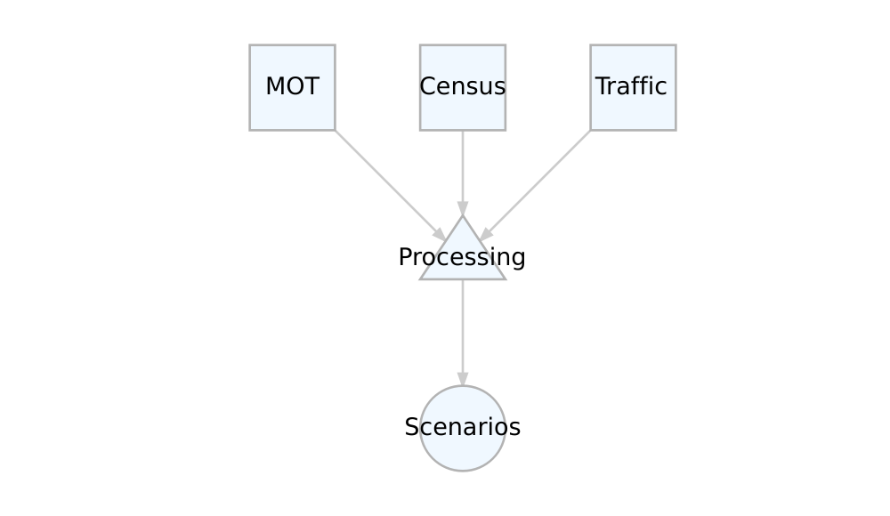
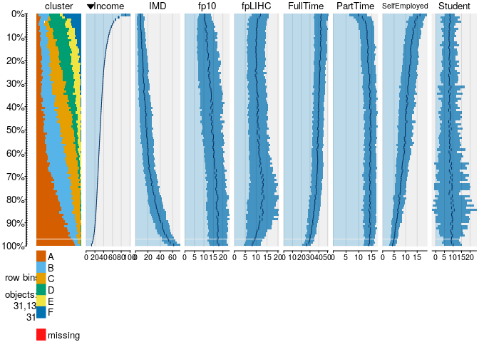
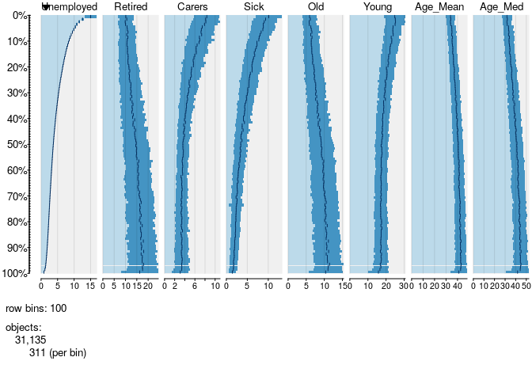
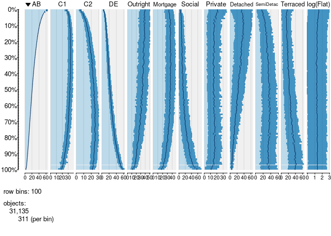
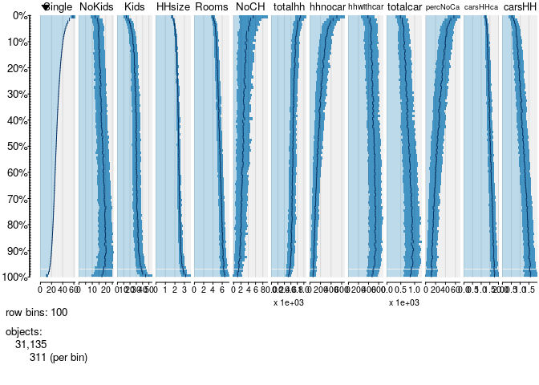
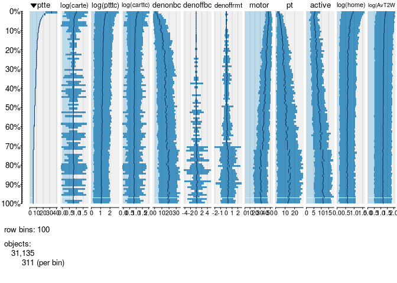

<!-- README.md is generated from README.Rmd. Please edit that file -->

# c2d

The goal of c2d is to host code for loading data used in creds2.

Fun example in Python to show reproducible code:

``` python
import numpy as np
x = [1, 2, 4, 9]
y = [2, 3, 5, 6]
# import matplotlib
z = np.add(x, y)
print(z)
#> [ 3  5  9 15]
```

## Packages used

We’ll use the following packages. Make sure you’ve installed them before
proceeding, e.g. with the following code:

``` r
pkgs = c(
  "DiagrammeR",
  "tidyverse",
  "tabplot"
)
install.packages(pkgs)
```

## Flow diagram

The plot below, generated using reproducible code stored in the script
`data-flow-diag.R`, is a data flow diagram
([DFD](https://en.wikipedia.org/wiki/Data_flow_diagram)). We will modify
this as the project evolve as we clarify the work to be done.

``` r
source("data-flow-diag.R")
render_graph(g, layout = "tree")
```

<!-- -->

## Exploration of data

``` r
library(tidyverse)
d = read_csv("all_cluster_variables.csv")
tabplot::tableplot(d[2:10], sortCol = "Income")
```

<!-- -->

``` r
tabplot::tableplot(d[11:18])
```

<!-- -->

``` r
tabplot::tableplot(d[19:30])
```

<!-- -->

``` r
tabplot::tableplot(d[31:43])
```

<!-- -->

``` r
tabplot::tableplot(d[44:55])
```

<!-- -->
